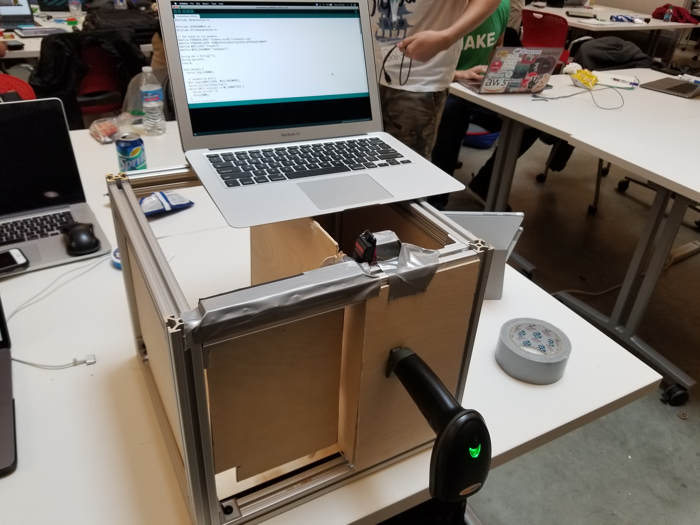

# MrSecure
MakeHarvard 2019 Project: Package Delivery System

Project: https://devpost.com/software/temporary-uioxk9

# Inspiration
Thousands of packages get stolen every year, and given the high population density, it’s not surprising that New York is also subject to numerous thefts caused by rushed deliveries. There have been many times this year where our group members have ordered supplies online only to find no trace of it when it finally announced its arrival. This not only serves as an inconvenience for consumers but also for companies as well. Online shopping websites like Amazon and shipping companies like UPS are held responsible for lost packages; for the more expensive products, they often go to great lengths to ensure the package’s safety. Our product intends to solve this issue by guaranteeing a safe and secure delivery using new technologies at a low-cost installation. By using the tracking number, we can identify the package and allow the carrier to drop it off inside the safety of your house.

# What it does
A small docking station is installed next to a door of a house or apartment. A barcode scanner will be placed next to the entrance of the dock where it will scan arriving packages. The user will have to manually input tracking numbers, and an Arduino connected to the scanner will match the arriving package with a list of stored packages. If there is a confirmed match, a servo-operated lid will open so that packages can be placed inside the house; for security reasons, the lid will close after 30 seconds of opening. The app also comes with notifications in which the user will be notified of a package’s arrival.

# How I built it
This project was built using a WiFi ESP8266 Module, ArduCam, One servo, USB Host Shield along with a barcode scanner. The two main aspects of this project were to connect the Arduino/WiFi Module to Firebase in order to retrieve information from the database. The second portion of this project was to connect the mobile app/consumer to the Firebase in order to push tracking numbers to the Arduino.

# Challenges I ran into
Connecting and syncing the wifi module/ESP8266 with Firebase and the barcode scanner via another Arduino. Another challenge that we faced was retrieving the tracking numbers stored into the database and relaying the information to the Arduino.

# Accomplishments that I'm proud of
We are proud that we made it to Harvard in one piece. We learned a lot throughout the course of this hackathon and over

# What I learned
We learned how to better navigate the Firebase platform by syncing it with Arduino and Swift. Completing this project taught us an important aspect of STEM, which is IoT. This field spans a wide range of topics and interests from developing mini robots to security systems. In addition to learning about IoT, we created an app to serve our customers with a friendly interface.

# What's next for MrSecure
Improve the appeal of the app’s User Interface and add more features like a real-time video feed for increased security.

# Built With:
Arduino, Swift, Firebase

